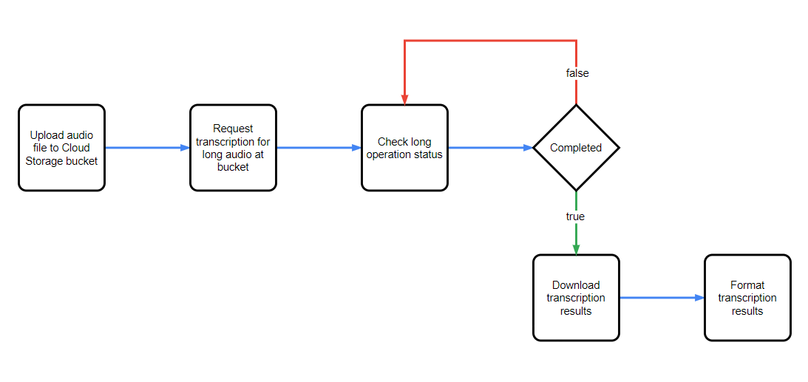

# Tutorial

Follow this tutorial after configuration steps at [README.md](../README.md).

---

This tutorial will show instructions according to the following process:  


## 0. Extracting audio from a video file:
This step is optional. In case you'd like to extract a speech from a 
video file.  
For this tutorial, put a video file with a speech in the following path: `assets/video.mp4`. Then, execute the following command:
```bash
python src/main.py vta --video-path="./assets/video.mp4"
# MoviePy - Writing audio in ./assets/temp/video.mp4.wav
# MoviePy - Done.
# YYYY-MM-DD HH:mm:ss.SSS | INFO | modules.service:retrieve_audio:45 | Audio exported to ./assets/temp/video.mp4.wav
```
This will create a audio file (WAV) at `./assets/temp` folder. The name of the file
will be the same as the input, but with the corresponding extension.

---

## 1. Uploading audio to Google Cloud Storage:
The following command will upload the local audio file to the GCS bucket from the `.env` file.
The file `./assets/temp/video.mp4.wav` is located and renamed in the bucket as `audio/audio.wav`.
```bash
python src/main.py ftc --src-file="./assets/temp/video.mp4.wav" --blob-name="audio/audio.wav"
# YYYY-MM-DD HH:mm:ss.SSS | INFO | modules.service:file_to_gcs:69 | File ./assets/temp/video.mp4.wav uploaded to: gs://{bucket-name}/audio/audio.wav
```

---

## 2. Request transcription:
The following command makes a request to Speech-to-Text API V2 that takes as input the blob path from an audio file and the destination blob path where the transcription will be placed.
Both blobs should be located at the bucket from the environment variable `GCP_STORAGE_NAME`.
The script will indicate if the transcription operation takes less than 10 seconds, else, 
it will show a message saying the operation is running in GCP.
```bash
python src/main.py att --src-blob="audio/audio.wav" --dst-blob="text/transcript.txt"
# YYYY-MM-DD HH:mm:ss.SSS | INFO | modules.service:dynamic_batch_transcription:119 | Request metadata exported to: ./assets/tracking/requests.csv
# YYYY-MM-DD HH:mm:ss.SSS | INFO | modules.service:dynamic_batch_transcription:122 | Operation completed: projects/{project-number}/locations/us-central1/operations/{operation}
```
In this tutorial, the audio is short and the service completed the request in less than 10 seconds. Details of the operations (finished or pending) are written into a file located at `assets/tracking/requests.csv`. This file shows the state of the request and the name of the operation.

---

## 3. Transcription operation status:
For scenarios where the operation takes longer, it is possible to use the file `assets/tracking/requests.csv` to retrieve the name of pending operations. With this attribute, execute the following command to check the status.
```bash
python src/main.py rto --operation-name="projects/{project-number}/locations/us-central1/operations/{operation}"
# YYYY-MM-DD HH:mm:ss.SSS | INFO | modules.service:retrieve_transcript:148 | Operation completed. Metadata exported to: ./assets/tracking/validation.csv
```
If the operation is completed, the script will save its metadata to the file `./assets/tracking/validation.csv`, else, it will show a message which indicates that the operations is still in progress. As the script uses dynamic batch for transcriptions, in some cases this could take up to 24 hours for results ([docs](https://cloud.google.com/blog/products/ai-machine-learning/google-cloud-speech-to-text-v2-api)).

---

## 4. Download transcription results:
In this step, the argument `--src-blob` takes the same value as `--dst-blob` from the step 3. The API exports the results to a folder with this name, so the flag `--folder` is required for this step to download all the contents from it.
```bash
python src/main.py ctl --src-blob="text/transcript.txt" --folder
# YYYY-MM-DD HH:mm:ss.SSS | INFO | modules.service:gcs_to_local:183 | Elements from "gs://{bucket-name}/text/transcript.txt" downloaded to: ./assets/downloads/transcript.txt
```
The folder will be downloaded to the local directory `./assets/downloads/`. The contents of the folder in GCS will be in a folder of the same name.
In this example, the results for the transcription will be at the local directory `./assets/downloads/transcript.txt`.

---

## 5. Format transcription to text file:
As results are JSON files, it is required to parse these into a single text file. The following command will 
take all files from the downloaded folder and make a single file with the relevant contents.
```bash
python src/main.py ttt --src-dir="./assets/downloads/transcript.txt" --dst-file="./assets/temp/transcription.txt"
# YYYY-MM-DD HH:mm:ss.SSS | INFO | modules.service:transcript_to_text:214 | Transcription text exported at: ./assets/temp/transcription.txt
```
For this example, check the transcription results at file `./assets/temp/transcription.txt`.
